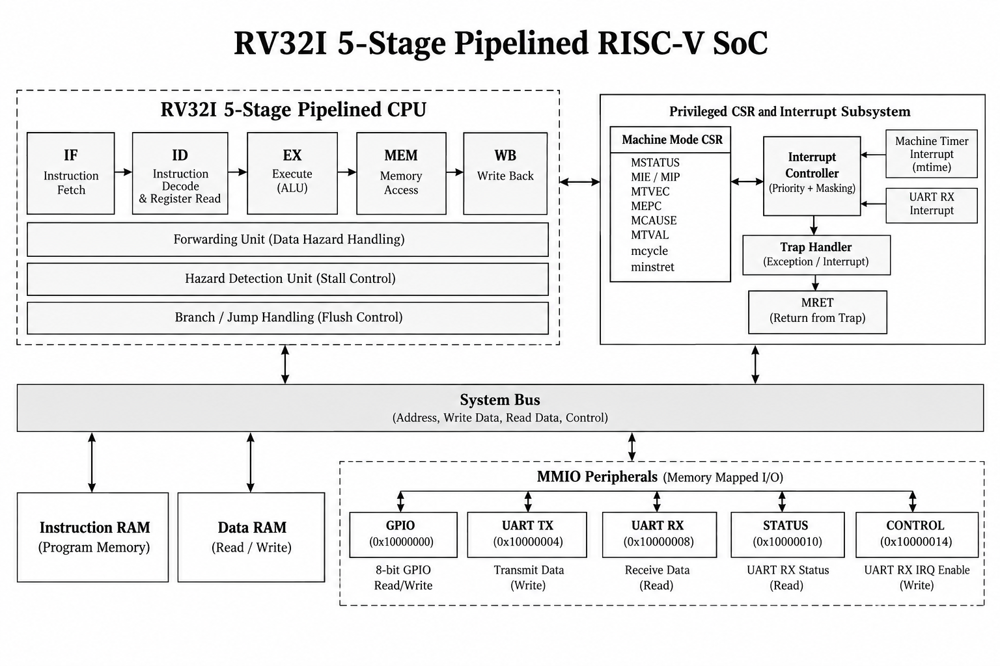
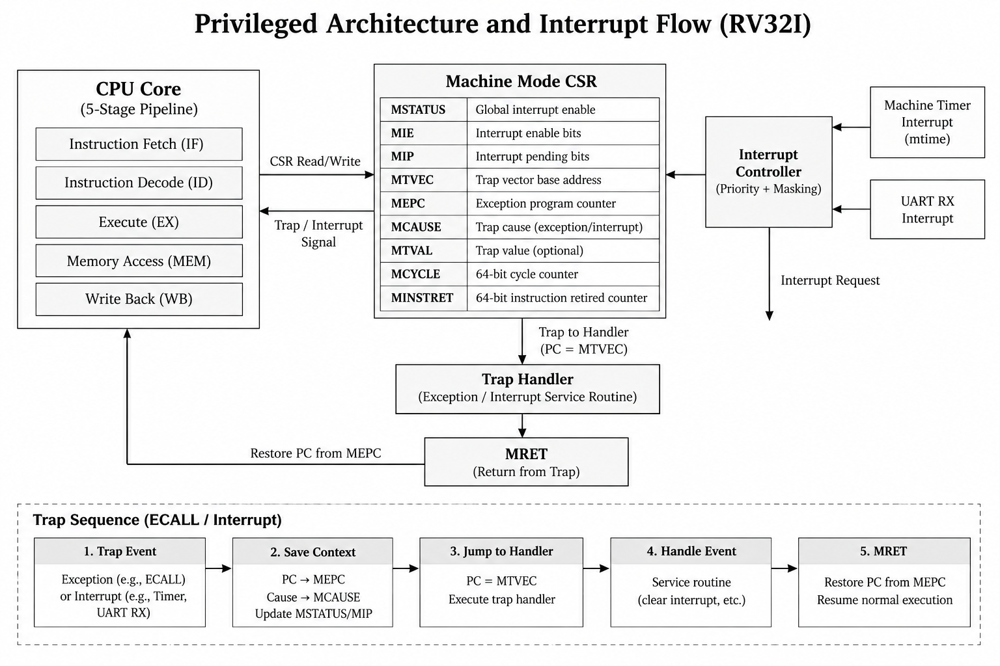
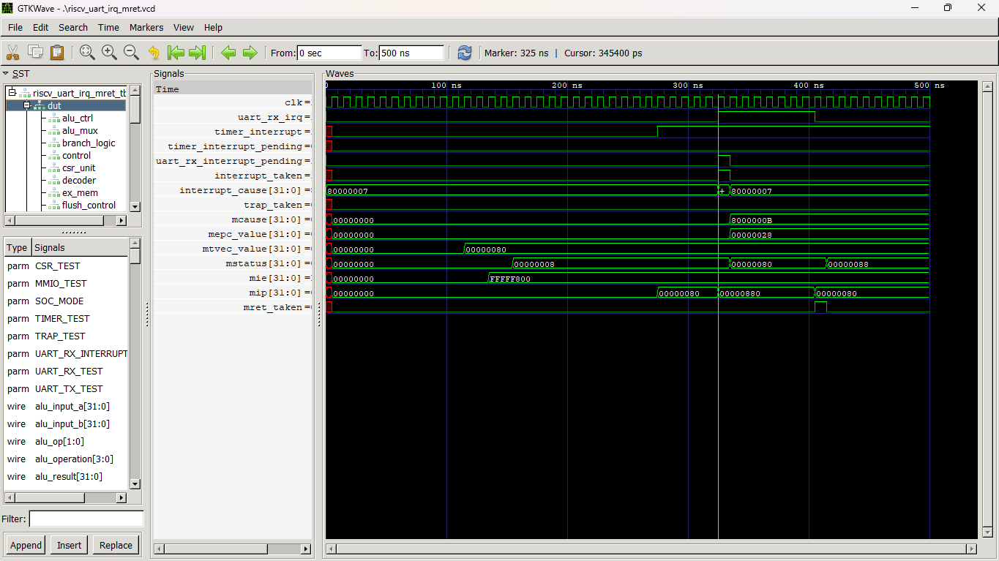
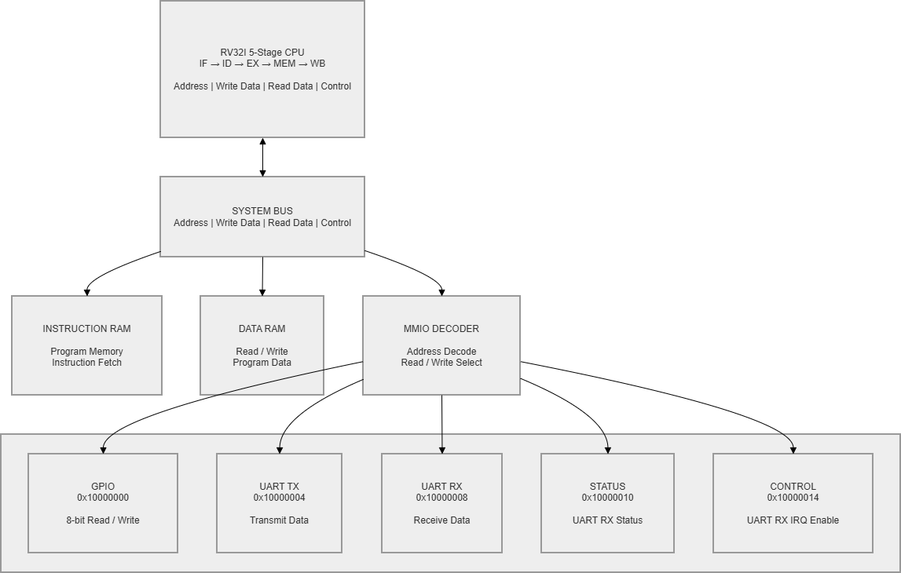
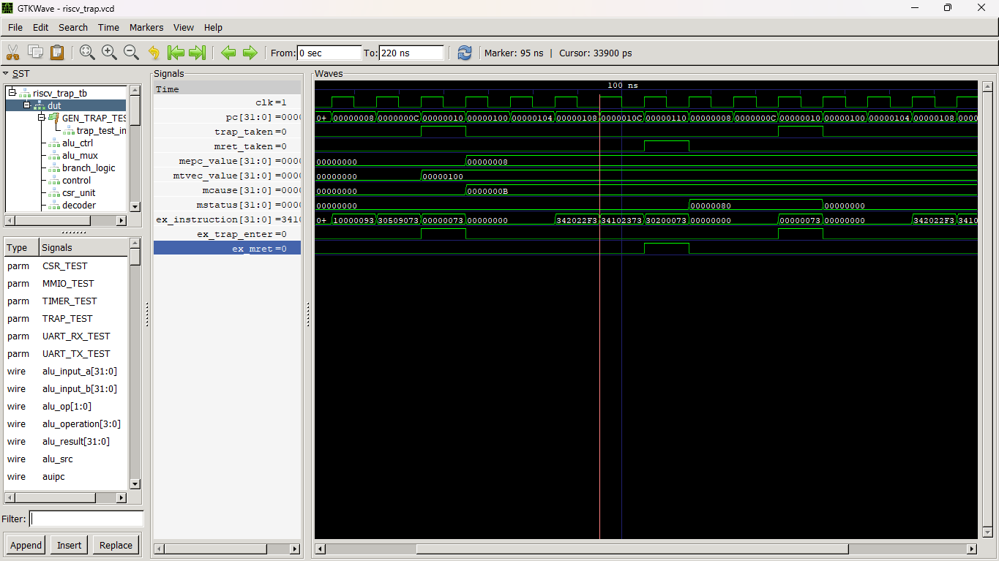
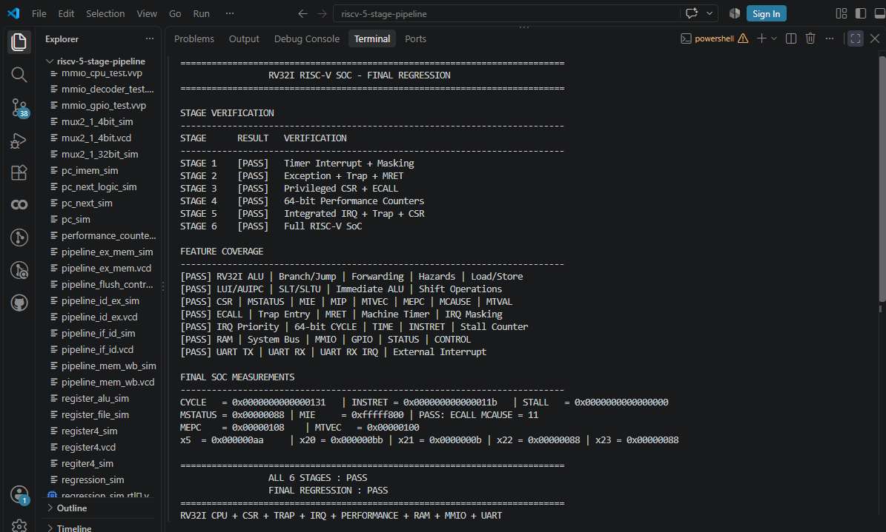

# RV32I 5-Stage Pipelined RISC-V SoC

A 32-bit RV32I RISC-V processor implemented in Verilog using a classic 5-stage pipeline and integrated into a small SoC with privileged machine-mode support, interrupts, MMIO peripherals, UART, and performance counters.

## Overview

The processor implements:

```text
IF -> ID -> EX -> MEM -> WB
```

Key features include:

- RV32I instruction support
- 5-stage pipelined datapath
- Data forwarding and hazard detection
- Branch and jump handling
- Load/store operations
- LUI and AUIPC
- Machine-mode CSR support
- ECALL, trap handling, and MRET
- Machine timer interrupt
- UART RX external interrupt
- Interrupt masking and priority
- 64-bit performance counters
- Instruction and data RAM
- System bus and MMIO
- GPIO
- UART TX/RX
- Self-checking RTL verification

---

## System Architecture



The SoC connects the pipelined CPU to instruction memory, data memory, CSR logic, interrupt sources, and memory-mapped peripherals.

---

## Processor Architecture

```text
             +----------------+
             | Instruction RAM|
             +-------+--------+
                     |
                     v
+------+   +------+   +------+   +------+   +------+
|  IF  |-->|  ID  |-->|  EX  |-->| MEM  |-->|  WB  |
+------+   +------+   +------+   +------+   +------+
               |          |          |
               v          v          v
          Register File  ALU      Data RAM/MMIO

          Forwarding + Hazard Detection
```

Pipeline support includes:

- IF/ID, ID/EX, EX/MEM, MEM/WB pipeline registers
- Data forwarding
- Load-use hazard detection
- Pipeline stalls
- Branch/jump redirection
- Pipeline flushing

---

## Privileged Architecture



Implemented machine-mode CSRs:

| CSR | Address |
|---|---:|
| MSTATUS | `0x300` |
| MIE | `0x304` |
| MTVEC | `0x305` |
| MSCRATCH | `0x340` |
| MEPC | `0x341` |
| MCAUSE | `0x342` |
| MTVAL | `0x343` |
| MIP | `0x344` |
| CYCLE | `0xC00` |
| TIME | `0xC01` |
| INSTRET | `0xC02` |

CSR instructions:

```text
CSRRW  CSRRS  CSRRC
CSRRWI CSRRSI CSRRCI
```

The processor supports:

```text
ECALL -> Trap Entry -> Handler -> MRET
```

---

## Interrupts

The SoC supports two interrupt sources:

```text
Machine Timer
     |
     +----> MIP[7]

UART RX
     |
     +----> MIP[11]
```

Interrupt handling includes:

- Global interrupt enable through `MSTATUS.MIE`
- Source masking through `MIE`
- Pending status through `MIP`
- Machine-mode trap entry
- Interrupt priority
- MRET return

UART RX external interrupt cause:

```text
0x8000000B
```

Timer interrupt cause:

```text
0x80000007
```

### UART RX Interrupt Verification



---

## MMIO Peripherals



| Address | Peripheral | Access |
|---|---|---|
| `0x10000000` | GPIO | Write |
| `0x10000004` | UART TX | Write |
| `0x10000008` | UART RX | Read |
| `0x10000010` | STATUS | Read |
| `0x10000014` | CONTROL | Write |

The SoC includes:

- GPIO MMIO
- UART TX
- UART RX
- STATUS register
- CONTROL register
- Data RAM
- System bus

---

## Performance Counters

The processor includes 64-bit performance counters:

```text
CYCLE
TIME
INSTRET
STALL
```

Counter access is available through the corresponding machine-mode CSRs.

The current implementation exposes `TIME` as an alias of the cycle counter.

---

## Verification

Verification was organized into six stages:

| Stage | Verification | Status |
|---|---|---|
| 1 | Timer Interrupt + Interrupt Masking | PASS |
| 2 | Exceptions + Trap Handling + MRET | PASS |
| 3 | Privileged CSR + ECALL | PASS |
| 4 | 64-bit Performance Counters | PASS |
| 5 | Integrated Interrupt + Trap + CSR | PASS |
| 6 | Full SoC Integration + Regression | PASS |

### ECALL / Trap / MRET



### Final Regression



The final Stage 6 regression verifies:

```text
CPU execution
RAM store/load
GPIO MMIO
UART TX
UART RX
UART RX interrupt
CSR
ECALL
Trap handling
MRET
64-bit performance counters
MMIO control
Interrupt priority
```

Final counter result from the regression:

```text
CYCLE   = 0x0000000000000131
INSTRET = 0x000000000000011b
STALL   = 0x0000000000000000
```

Final CSR state:

```text
MSTATUS = 0x00000080
MIE     = 0xfffff800
MCAUSE  = 0x8000000b
MEPC    = 0x00000108
MTVEC   = 0x00000100
```

Final regression result:

```text
STAGE 6 FULL SOC REGRESSION PASS
PROJECT FINAL REGRESSION PASS
```

---

## Repository Structure

```text
riscv-5-stage-pipeline/
|
+-- rtl/                    # Processor and SoC RTL
+-- tb/                     # Verification testbenches
+-- docs/
|   +-- images/             # Architecture and waveform images
|
+-- run_final_regression.ps1
+-- .gitignore
+-- README.md
```

---

## Tools

| Tool | Purpose |
|---|---|
| Verilog | RTL implementation |
| Icarus Verilog 12.0 | Simulation |
| GTKWave 3.3.100 | Waveform analysis |
| VS Code | Development |
| Git / GitHub | Version control |

---

## Running the Regression

From the project root:

```powershell
.\run_final_regression.ps1
```

The script executes the six verification stages using Icarus Verilog and reports the final regression status.

For a manual simulation:

```powershell
iverilog -g2012 -o simulation rtl\*.v tb\riscv_core_tb.v
vvp simulation
```

Generated simulation files such as `.vcd`, `.vvp`, and `_sim` executables are excluded from version control.

---

## Project Status

```text
RV32I CPU                    COMPLETE
5-Stage Pipeline             COMPLETE
Forwarding / Hazards         COMPLETE
CSR / Privileged Support     COMPLETE
Trap / ECALL / MRET          COMPLETE
Timer Interrupt              COMPLETE
UART RX Interrupt            COMPLETE
64-bit Counters              COMPLETE
MMIO / RAM / GPIO            COMPLETE
UART TX / RX                 COMPLETE
Integrated Verification      COMPLETE
Final SoC Regression         PASS
```

## Release

**V3.0-FINAL**

Final implementation commit:

```text
5a75029 - V3.0 Complete RV32I SoC - Final Regression Pass
```

---

## Author

**Kathir M**

ECE | RTL Design & Verification

Focus:

```text
RTL Design
Verilog / SystemVerilog
RISC-V
CPU Architecture
SoC Design
Functional Verification
```